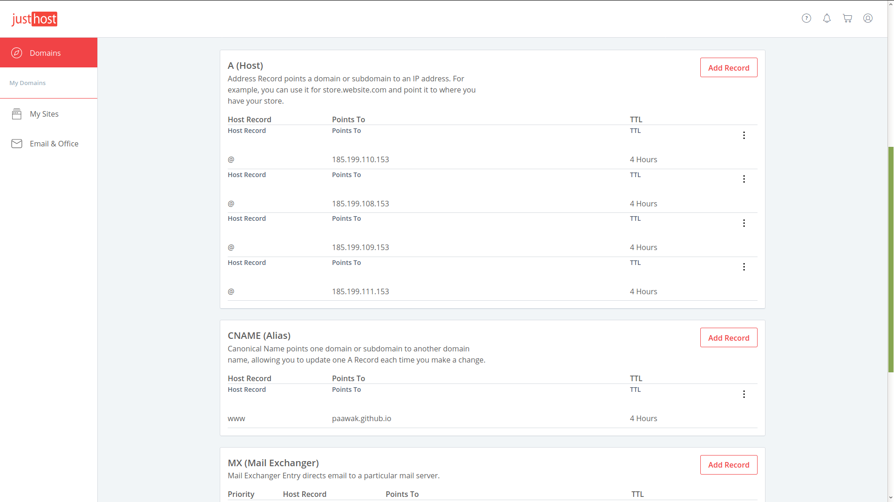

# Introduction
This is the repo for my blogs. I am using [Jekyll](https://jekyllrb.com/docs/) for blogging. Earlier, I was using Wordpress, but then, the hosting used to be a real hassle, and I was looking for something very simple. So I switched over to Jekyll, recently. I used their great plugins to import my Wordpress Site into Jekyll.

# Quick Start
## Building

    bundle exec jekyll serve

Now, browse to [http://localhost:4000](http://localhost:4000)    

For live loading, you can use the below command

    bundle exec jekyll serve --livereload

# Setting Up Custom Theme
I am using the theme called [jekyll-theme-clean-blog](https://github.com/StartBootstrap/startbootstrap-clean-blog-jekyll).

This is how to configure this, sample repo: <https://github.com/StartBootstrap/startbootstrap-clean-blog-jekyll/blob/master/Gemfile>. I have followed this and setup my theme.

# Code Syntax Highlighter
After lot of search, I have downloaded the CSS for syntax-highlighter from here <https://github.com/jwarby/jekyll-pygments-themes/tree/master>.

Then, in the __\_include\head.html__, I have manually included the below line:

```html
<link rel="stylesheet" href="/css/emacs.css">
```

# Implementing Search
I followed the below blog: <https://blog.webjeda.com/instant-jekyll-search/>

# Setting Up Custom Domain
Follow the below links:
1. <https://medium.com/@hossainkhan/using-custom-domain-for-github-pages-86b303d3918a>
2. <https://docs.github.com/en/github/working-with-github-pages/managing-a-custom-domain-for-your-github-pages-site>

This is how the Domain configuration on Just Host looks like:


# Convert Markdown to Docx
Look at this excellent blog <https://mrjoe.uk/convert-markdown-to-word-document/>

This is the command:

    pandoc -o output.docx -f markdown -t docx filename.md
