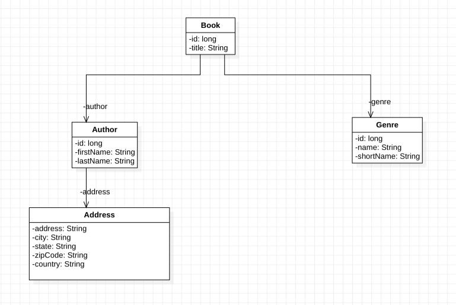

# Prelude
My brush with PHP was quite accidental. I was a young Java programmer way back in 2002, and a proud one. A friend and mentor, was playing around with this crazy thing, that took hours of effort to get installed on Windows (I did not know Linux very well that time). First you install Apache Server, and then PHP extension on it. That, as I said was quite an effort. However, he did it so many times, that he could do it almost in his sleep. I got curious and started playing around with it too. Its very C-like syntax made it very easy to learn. But its total lack of type safety and dynamic nature, made me love to hate it. It was 2002 and, we were on PHP 4, I believe. When I look back, I feel, I was lucky that I learnt PHP: it gave me my first major break. Though I was not an expert in PHP, at some point, within a couple of years, I had become comfortable with PHP, and had gained a good insight into its working. However, since I always belonged to the Java world, I could never completely love PHP. So, probably after 2005, I almost completely stopped coding in PHP, to focus on Java.

Fast forward to 2020. During the brutal lockdown due to Covid 19, we were cooped up like chicken, not able to venture out much. I was trying to do something with Tesseract in Bangla language. I thought of creating a [website](http://ocr.paawak.me/). Now, though the [backend](https://github.com/paawak/porua-ocr-service) was written in Java, hosting it would be a rather costly affair. So, I decided to re-write some parts of it in [PHP](https://github.com/paawak/porua-correction-service).

Thus, I had to kind of re-discover my old friend PHP.

In the span of roughly one and a half decades, things have drastically changed. PHP 8 has just been released, and in terms of features and frameworks, it can match Java to a large extent.

In this post, I will highlight how to write a fully featured, enterprise grade REST Service using PHP. This will have a Dependency Injection Framework, a ORM Framework etc.

# What are we building?
We would be building a simple REST Framework for adding and retrieving Books. Each book would have an Author and a Genre.

## Choosing a Package Manager
[Composer](https://getcomposer.org/) is the ubiquitous dependency manager, or in Java terms, a package manager. Well, its really very similar to *npm* in the JavaScript world. So we would use Composer to manage our package dependencies.

Well its very simple: you define a *composer.json* in your root folder. A typical one looks like this:

```json
{
    "name": "paawak-blog/rest-service-with-php-slim4",
    "description": "Example of a REST Service with PHP Slim4",
    "license": "proprietary",
    "require": {
        "slim/slim": "4.*",
        "slim/psr7": "^1.1",
        "doctrine/orm": "^2.7",
        "monolog/monolog": "^2.1",
        "php-di/php-di": "^6.2",
        "php-di/slim-bridge": "^3.0"
    }
}
```

## Choosing a framework
PHP has many mature frameworks. I chose [Slim](https://www.slimframework.com/), which is a lightweight, no-frills framework for writing REST services. As of this writing, the latest version is [Slim4](https://www.slimframework.com/docs/v4/). Slim4 supports (PSR-7)[https://www.php-fig.org/psr/psr-7/] interfaces for its Request/Response objects. We would be using PSR7 interfaces wherever possible, so that we are not tightly coupled to Slim framework.

Add the below lines to your *composer.json* to add Slim4 dependency:

```json
{
    "name": "paawak-blog/rest-service-with-php-slim4",
    "description": "Example of a REST Service with PHP Slim4",
    "license": "proprietary",
    "require": {
        "slim/slim": "4.*",
        "slim/psr7": "^1.1",
...
    }
}
```

Note that we need to add PSR7 as well.

## Dependency Injection
Coming from Java background, I started looking for a good Dependency Injection Framework. I found [PHP DI](https://php-di.org/) to be pretty good. To use it with Slim4, we would need the [DI Slim Bridge](https://php-di.org/doc/frameworks/slim.html). We would need to add the below lines to our *composer.json*:

```json
{
    "name": "paawak-blog/rest-service-with-php-slim4",
    "description": "Example of a REST Service with PHP Slim4",
    "license": "proprietary",
    "require": {
...
        "php-di/php-di": "^6.2",
        "php-di/slim-bridge": "^3.0"
    }
}
```

To install all the required packages and their dependencies, run the below command (assuming, of course, that you have already installed *composer.phar*):

    composer.phar install

To update any dependency, use:

    composer.phar update    

### DI Goals
We would like to achieve the below objectives:
  1. __Code to interface:__ This is our primary focus. We would like to define an interface and tie it to its implementation class, so that it can either be autowired, or fetched from the *DI Container*, given its interface.
  2. __Environment configuration details:__ We would like to store our environment specific configuration details like DB username/password, so that we could retrieve it using a *key*.

### Basic concepts of PHP-DI
At the heart of the *PHP-DI* is the *container*, which is analogous to the *ApplicationContext* in Spring. *PHP-DI* works with PSR's *Psr\Container\ContainerInterface* interface, which ensures that our code is not too much tied to the *PHP-DI Framework*, but more loosely coupled. The *PHP-DI* defines a builder called *ContainerBuilder*, which helps us to create an instance of *ContainerInterface*. The *ContainerBuilder* has an utility method *addDefinitions()*, which takes in an *Associative Array*. This Array (basically *Map* in Java), has the *key* as either a *string* or a *class*, and the *value* as an *Object*.

After we obtain an instance of the *ContainerInterface*, we could pass it around and obtain the various *objects* that we have defined by their respective *keys*. We would also use the *ContainerInterface* to obtain an instance of Slim's *App*, so that autowiring works seamlessly.

We would demo these in the subsequent sections.

### Bean definition
We define beans as simple *Associative Arrays*. The below file *LocalApplicationConfig.php*, defines environment specific configuration parameters as shown below:

```php
return [
    'database.host' => 'localhost',
    'database.name' => 'rest_service_with_php_slim4',
    'database.driver' => 'pdo_mysql',
    'cors.allow-origin' => '*',
    'logger.fileName' => '../logs/rest-service-with-php-slim4.log',
    'logger.maxFiles' => 10,
    'logger.console' => true
];
```

We could do a more elegant definition, where we tie an interface to its implementation. This is done in the file *DIConfiguration.php* as shown below:

```php
return [
MyAwesomInterface::class => function (ContainerInterface $container) {
    $awesome = new MyAwesomInterfaceImpl($container->get('myKey_1'), $container->get('myKey_2'));
    return $awesome;
}
];
```

Note that we are passing in the *ContainerInterface*, and getting our other beans from there as well.

### Creating the DI Container
We would use the *ContainerBuilder* to obtain an instance of the *ContainerInterface* as shown below:

```php
$containerBuilder = new ContainerBuilder;
$containerBuilder->addDefinitions(__DIR__ . '/DIConfiguration.php');

$containerBuilder->addDefinitions(__DIR__ . '/LocalApplicationConfig.php');

$container = $containerBuilder->build();

return $container;
```

### Creating the Slim App
The final piece in the puzzle is creating Slim's *App* using the instance of the freshly minted *ContainerInterface*, so that DI works seamlessly with autowiring. This is how it is done:

```php
use DI\Bridge\Slim\Bridge;

$app = Bridge::create($container);
```

## Configuring a Logger
We would use [Monolog](https://github.com/Seldaek/monolog) for logging. It is pretty intuitive to use and configure. The nice thing about Monolog is that it works with PSR7's *LoggerInterface*.

The composer dependency is:

```json
{
    "name": "paawak-blog/rest-service-with-php-slim4",
    "description": "Example of a REST Service with PHP Slim4",
    "license": "proprietary",
    "require": {
        "monolog/monolog": "^2.1",
    }
}

```

We would configure Monolog in our DI definition file as below:

```php
LoggerInterface::class => function (ContainerInterface $container) {
    $dateFormat = "Y-m-d\TH:i:sP";
    $output = "[%datetime%] %level_name%: %message% %context% %extra%\n";
    $formatter = new LineFormatter($output, $dateFormat);

    $logger = new Logger('ocr-correction-rest');
    $fileHandler = new RotatingFileHandler($container->get('logger.fileName'), $container->get('logger.maxFiles'));
    $fileHandler->setFormatter($formatter);
    $logger->pushHandler($fileHandler);

    if ($container->get('logger.console') === true) {
        $consoleHandler = new StreamHandler('php://stdout', Logger::DEBUG);
        $consoleHandler->setFormatter($formatter);
        $logger->pushHandler($consoleHandler);
    }

    $logger->pushProcessor(new IntrospectionProcessor());

    ErrorHandler::register($logger);

    return $logger;
}
```

The above configuration logs in file as well as console, if enabled.

## Creating a REST service
Now that we have configured our DI framework, and our logger, we are ready to write our first REST service. In a nutshell, we would need to create an instance of Slim *App* and configure our routing from that instance. We would do these configurations in the *index.php*.

### Getting an App instance
First, we instantiate the DI Container and obtain an instance of Slim *App*:

```php
$container = require __DIR__ . '/swayam/config/DIContainerBootstrap.php';
$app = Bridge::create($container);
```

### Configure Error Handler

```php
$callableResolver = $app->getCallableResolver();
$responseFactory = $app->getResponseFactory();
$logger = $container->get(LoggerInterface::class);
$errorHandler = new ErrorHandler($callableResolver, $responseFactory, $logger);
```

### Configure Routing

```php
$app->addRoutingMiddleware();
$app->addBodyParsingMiddleware();
$errorMiddleware = $app->addErrorMiddleware(true, true, true);
$errorMiddleware->setDefaultErrorHandler($errorHandler);
```

### CORS configuration
In Slim, there are various ways of configuring CORS. The most elegant approach is to write a Middleware that would add the needed CORS Headers in the response.

```php
use Psr\Container\ContainerInterface;
use Psr\Log\LoggerInterface;
use Psr\Http\Message\ServerRequestInterface as Request;
use Psr\Http\Server\RequestHandlerInterface as RequestHandler;
use Slim\Psr7\Response;

class RequestInterceptingMiddleware {

    private $container;
    private $logger;

    public function __construct(ContainerInterface $container, LoggerInterface $logger) {
        $this->container = $container;
        $this->logger = $logger;
    }

    public function __invoke(Request $request, RequestHandler $handler): Response {
        $this->logger->info("Handling request of type: " . $request->getMethod() . ", with target-uri: " . $request->getRequestTarget());

        if ($request->getRequestTarget() === '/') {
            return $handler->handle($request);
        }

        if ($request->getMethod() === 'OPTIONS') {
            return $this->addCORSHeaders(new Response());
        }

        //call the actual handler now
        $response = $handler->handle($request);

        //add CORS before returning
        return $this->addCORSHeaders($response);
    }

    private function addCORSHeaders(Response $response): Response {
        return $response
                        ->withHeader('Access-Control-Allow-Origin', $this->container->get('cors.allow-origin'))
                        ->withHeader('Access-Control-Allow-Headers', 'X-Requested-With, Content-Type, Accept, Origin, Authorization')
                        ->withHeader('Access-Control-Allow-Credentials', 'true')
                        ->withHeader('Access-Control-Allow-Methods', 'GET, POST, PUT, DELETE, PATCH, OPTIONS');
    }

}
```

Then add the below lines in the *index.php*.

```php
$app->options('/{routes:.+}', function ($request, $response, $args) {
    return $response;
});

$app->add($container->get(RequestInterceptingMiddleware::class));
```

The first line tells *App* to return an empty response when the request type is *OPTIONS*.

The second line adds the *RequestInterceptingMiddleware* as a middleware, to be called upon every request that is handled.

### Define a simple route
It is very easy to define a simple route. We would define a class *IndexController* that would return a health check status.

```php
use Psr\Http\Message\ResponseInterface as Response;
use Psr\Http\Message\ServerRequestInterface as Request;

class IndexController {

    public function get(Request $request, Response $response) {
        $payload = json_encode(['health' => 'OK'], JSON_PRETTY_PRINT);
        $response->getBody()->write($payload);
        return $response->withHeader('Content-Type', 'application/json');
    }

}
```

This is how we attach it to a route in *index.php*:

```php
$app->get('/', [IndexController::class, 'get']);
```

Here, the *PHP-DI* does its magic.

### Define a route with path parameters
We define the *AuthorController* as below:

```php
class AuthorController {

    private $authorRepository;
    private $logger;

    public function __construct(AuthorRepository $authorRepository, LoggerInterface $logger) {
        $this->authorRepository = $authorRepository;
        $this->logger = $logger;
    }

    public function getAuthorById(Request $request, Response $response, $authorId) {
        $author = $this->authorRepository->getAuthorById($authorId);
        $payload = json_encode($author, JSON_PRETTY_PRINT);
        $response->getBody()->write($payload);
        return $response->withHeader('Content-Type', 'application/json');
    }
...
}
```

In the *index.php*, configure the route as below:

```php
$app->get('/author/{authorId}', [AuthorController::class, 'getAuthorById']);
```

Note how we expose the path parameter as a variable.

### Converting JSON into a PHP Object
Consider the below JSON that we use in a *POST* operation to save an *Author*:

```json
{
    "firstName": "Balaichand",
    "lastName": "Mukhopadhyay",
    "address": {
        "address": "Manihari Gram",
        "city": "Poornia",
        "state": "Bangla",
        "zipCode": "713876",
        "country": "India"
    }
}
```

First, we parse the JSON into a PHP Array as shown below:

```php
$authorRequestAsArray = $request->getParsedBody();
```

Also, we define a static helper method in our *Author* class:

```php
public static function fromJsonArray($authorAsArray) {
    $author = new Author();
    foreach ($authorAsArray as $fieldName => $value) {            
        if ($fieldName === 'address') {
            $author->address = Address::fromJsonArray($value);
        } else {
            $author->{$fieldName} = $value;
        }
    }
    return $author;
}
```

We then call it from our controller, as shown below:

```php
$authorEntity = Author::fromJsonArray($authorRequestAsArray);
```

## Doctrine: the PHP ORM Framework
No enterprise grade product is good enough without a good ORM. Developers can no longer be expected to hand-code SQL statements, and map out results into Objects etc. [Doctrine ORM](https://www.doctrine-project.org/projects/orm.html) is a feature rich intuitive framework that works with a wide variety of databases, with little fuss. Moreover, it is semantically pretty close to *Hibernate/JPA* from Java world, so has very little learning curve for someone like me.

This is how we include it in our *composer.json*:

```json
{
    "name": "paawak-blog/rest-service-with-php-slim4",
    "description": "Example of a REST Service with PHP Slim4",
    "license": "proprietary",
    "require": {
        "doctrine/orm": "^2.7",
    }
}
```

### Defining the EntityManager
At the heart of Doctrine is the *EntityManager* that helps in doing CRUD operations from the database.

This is how we define it in our DI-Config:

```php
EntityManager::class => function (ContainerInterface $container) {
    $dbParams = array(
        'driver' => $container->get('database.driver'),
        'user' => $container->get('database.user'),
        'password' => $container->get('database.password'),
        'dbname' => $container->get('database.name'),
        'host' => $container->get('database.host'),
        'charset' => 'UTF8'
    );

    $isDevMode = true;
    $proxyDir = null;
    $cache = null;
    $useSimpleAnnotationReader = false;
    $config = Setup::createAnnotationMetadataConfiguration(array(__DIR__ . "/../model"), $isDevMode, $proxyDir, $cache, $useSimpleAnnotationReader);

    $entityManager = EntityManager::create($dbParams, $config);
    return $entityManager;
}
```

Note that the *Setup::createAnnotationMetadataConfiguration()* takes in an array of locations which contain the Entities.

### Entity Relationship
This is how our Entities look like:


### Defining a simple Entity
Let us see how *Genre* is defined. This is the schema for *Genre*:

```sql
CREATE TABLE genre (
	id BIGINT(20) NOT NULL UNIQUE PRIMARY KEY AUTO_INCREMENT,
	short_name VARCHAR(10) NOT NULL,
	name VARCHAR(100) NOT NULL
);
```

This is how we would define the entity:

```php
use Doctrine\ORM\Mapping\Entity;
use Doctrine\ORM\Mapping\Table;
use Doctrine\ORM\Mapping\Id;
use Doctrine\ORM\Mapping\GeneratedValue;
use Doctrine\ORM\Mapping\Column;

/**
 * @Entity
 * @Table(name="genre")
 */
class Genre implements \JsonSerializable {

    /**
     * @Id
     * @Column(type="integer")
     * @GeneratedValue(strategy="IDENTITY")
     */
    private $id;

    /** @Column(type="string") */
    private $name;

    /** @Column(name="short_name", type="string") */
    private $shortName;

}
```

Note that the annotations are very similar to JPA.

### One to One Association
Consider the schema for the *book* table:

```sql
CREATE TABLE book (
	id BIGINT(20) NOT NULL UNIQUE PRIMARY KEY AUTO_INCREMENT,
	title TEXT NOT NULL,
	author_id BIGINT(20) NOT NULL,
	genre_id BIGINT(20) NOT NULL,
	FOREIGN KEY (author_id) REFERENCES author(id),
	FOREIGN KEY (genre_id) REFERENCES genre(id)
);
```

We define the *Book* entity as below:

```php
use Doctrine\ORM\Mapping\Entity;
use Doctrine\ORM\Mapping\Table;
use Doctrine\ORM\Mapping\Id;
use Doctrine\ORM\Mapping\GeneratedValue;
use Doctrine\ORM\Mapping\Column;
use Doctrine\ORM\Mapping\OneToOne;
use Doctrine\ORM\Mapping\JoinColumn;

/**
 * @Entity
 * @Table(name="book")
 */
class Book implements \JsonSerializable {

    /**
     * @Id
     * @Column(type="integer")
     * @GeneratedValue(strategy="IDENTITY")
     */
    private $id;

    /** @Column(type="string") */
    private $title;

    /**
     * @OneToOne(targetEntity="Author")
     * @JoinColumn(name="author_id", referencedColumnName="id")
     */
    private $author;

    /**
     * @OneToOne(targetEntity="Genre")
     * @JoinColumn(name="genre_id", referencedColumnName="id")
     */
    private $genre;

}
```

### Using Embedded
It is a common practice to use an *Embedded* class within an Entity to promote reuse.

Consider the below schema of the *author* table:

```sql
CREATE TABLE author (
	id BIGINT(20) NOT NULL UNIQUE PRIMARY KEY AUTO_INCREMENT,
	first_name VARCHAR(200) NOT NULL,
	last_name VARCHAR(200) NOT NULL,
        address VARCHAR(200) NOT NULL,
        city VARCHAR(200) NOT NULL,
        state VARCHAR(200) NOT NULL,
        zip_code VARCHAR(50) NOT NULL,
        country VARCHAR(200) NOT NULL
);
```

Here the address fields can be abstracted out into an *Embeddable* as shown below:

```php
use Doctrine\ORM\Mapping\Embeddable;
use Doctrine\ORM\Mapping\Column;

/**
 * @Embeddable
 */
class Address implements \JsonSerializable {

    /**
     * @Column(type="string")
     */
    private $address;

    /**
     * @Column(type="string")
     */
    private $city;

    /**
     * @Column(type="string")
     */
    private $state;

    /**
     * @Column(name = "zip_code", type="string")
     */
    private $zipCode;

    /**
     * @Column(type="string")
     */
    private $country;
}    
```

We can now use it with the *Author* entity as shown below:

```php
use Doctrine\ORM\Mapping\Entity;
use Doctrine\ORM\Mapping\Embedded;
use Doctrine\ORM\Mapping\Table;
use Doctrine\ORM\Mapping\Id;
use Doctrine\ORM\Mapping\GeneratedValue;
use Doctrine\ORM\Mapping\Column;

/**
 * @Entity
 * @Table(name="author")
 */
class Author implements \JsonSerializable {

    /**
     * @Id
     * @Column(type="integer")
     * @GeneratedValue(strategy="IDENTITY")
     */
    private $id;

    /** @Column(name="first_name", type="string") */
    private $firstName;

    /** @Column(name="last_name", type="string") */
    private $lastName;

    /**
     * @Embedded(class = "Address", columnPrefix=false)
     */
    private $address;
}
```

### Simple CRUD Operations
All CRUD operations are done through the *EntityManager*.

The below method would save a new *Author* entity:

```php
public function addNewAuthor(Author $author): Author {
    $this->entityManager->persist($author);
    $this->entityManager->flush();
    return $author;
}
```

The method returns an *Author* having the auto-generated id in it.

The below code would fetch all *Authors*:

```php
public function getAllAuthors(): Array {
    return $this->entityManager->getRepository(Author::class)->findAll();
}
```

The below code would fetch an *Author*, given its id:

```php
public function getAuthorById(int $authorId): Author {
    return $this->entityManager->getRepository(Author::class)->find($authorId);
}
```

A slightly tweaked scenario: fetch all *Authors* from a given *country*:

```php
public function searchAuthorsByCountry(string $country): array {
    return $this->entityManager->getRepository(Author::class)->findBy(
                    array(
                        'address.country' => $country
                    ),
                    array('id' => 'DESC')
    );
}
```

Note that using *columnPrefix=false* as a parameter of the *@Embedded*, in this case the *Address* column, is very important. Otherwise the above query *'address.country' => $country* will not work. Refer to this [section](https://www.doctrine-project.org/projects/doctrine-orm/en/2.7/tutorials/embeddables.html#column-prefixing) for more details.

### Saving a new Entity having references to existing entities
Let us consider a scenario where we would like to save a new *Book*. This *Book* refers to a *Genre* and an *Author*. The only twist is that, both the *Genre* and the *Author* already exists in the database. The *Book* just has the IDs of the *Genre* and the *Author*.

This is how the JSON representation of the *Book* looks like:
```json
{
    "title": "Agniswar",
    "author": {
        "id": "1"
    },
    "genre": {
        "id": "1"
    }    
}
```

If we try to use the normal *entityManager->persist()*, it will not work as it will try to insert the *Author* and the *Genre*. We could use the deprecated *entityManager->merge()*, but it might be removed in the future. So, what we have done is, converting the *Author* and the *Genre* from *Detatched State* to *Persistant State*. We do this by querying the respective object graphs as shown below:

```php
public function addNewBook(Book $book): Book {   
    $authorId = $book->getAuthor()->getId();
    $authorEntity = $this->authorRepository->getAuthorById($authorId);
    if ($authorEntity == null) {
        throw new Exception("No author found for the id" . $authorId);
    }

    $genreId = $book->getGenre()->getId();
    $genreEntity = $this->genreRepository->getGenreById($genreId);
    if ($genreEntity == null) {
        throw new Exception("No genre found for the id" . $genreId);
    }

    $book->setAuthor($authorEntity);
    $book->setGenre($genreEntity);

    $this->entityManager->persist($book);
    $this->entityManager->flush();
    return $book;
}
```

Note how we replace the partial objects with *Persistant Entities* in *Book*, and then persist it.

# Deploying on Apache

When deployed on Apache Server, some service calls fail with HTTP Status 404, Page Not Found. For Example, the below call fails:

    curl -v "http://localhost:8000/author/1"

The issue is that, the Apache server looks for these path inside the directories, instead of delegating it to the Slim container. The solution is to ask Apache to always redirect the calls to the *index.php*. To do that, we would need to edit the *.htaccess* file, and put the below lines:

    RewriteEngine On
    RewriteCond %{REQUEST_FILENAME} !-f
    RewriteCond %{REQUEST_FILENAME} !-d
    RewriteCond %{REQUEST_METHOD} (PUT|DELETE|GET|POST|OPTIONS)
    RewriteRule ^(.*)$ index.php

# Sources
A fully working code can be found here: <https://github.com/paawak/blog/tree/master/code/php/rest-service-with-php-slim4>
