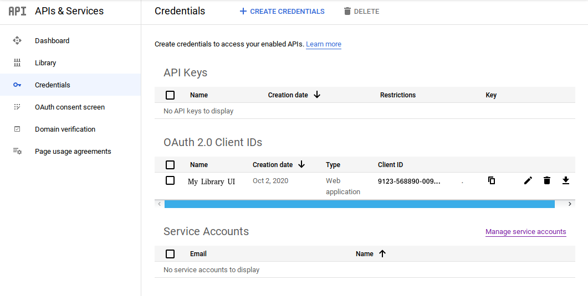

# Introduction
Today, we will see how to integrate *Google Authentication* with a front-end application written in ReactJS, Typescript combination.

# Application flow
We would be building a mock Library software, where people can login to add and browse books. This would be secured with Google Authentication. This is how the login screen would look like:

When the user clicks on the *Google button*, he would be re-directed to login into his Google account. On successful login, the user would be able to see the application screen:

In addition to that, the user would also see a logout button on the Menu Bar as shown below:

However, if the Google login fails, an error message is displayed as shown below:

# Before we start
We would first, need to create an account in Google and create the authorization credentials. Here is a post that can guide you do that: <https://developers.google.com/identity/sign-in/web/sign-in>. Follow the steps, at the end of it, you should see something like this on your [Credential Console](https://console.developers.google.com):

Note down the *Client ID*, as we would need that to authenticate users into our App.

# Sources
A fully working code can be found here: <https://github.com/paawak/blog/tree/master/code/reactjs/library-ui-secured-with-google>
