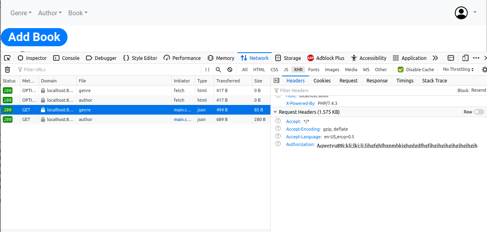

# Introduction
In our previous post, [Google Authentication with ReactJS and Typescript](http://palashray.com/google-authentication-with-reactjs-and-typescript/) we saw how to integrate our Frontend Application with Google Authentication. Today, we will see how to integrate our PHP Backend to authenticate with Google. For this, we will build on top of our previous blog [Creating REST Service with PHP from a Java programmer’s perspective](http://palashray.com/creating-rest-service-with-php-from-a-java-programmers-perspective/). We would be securing all the PHP REST calls, so that each of them would need Google Authentication to work.

# Library to use
 There is an excellent article here: [Authenticate with a backend server](https://developers.google.com/identity/sign-in/web/backend-auth). Following its recommendation, I have used the [Google API Client Library for PHP](https://github.com/googleapis/google-api-php-client).

 This is the Composer entry:

 ```json
 {
    "require": {
        "google/apiclient": "^2.7"
    }
}
 ```

# Implementation
We will write a Slim request interceptor, which, is much like a Java Servlet Filter. It would intercept all requests. It would read the *Authentication Header* from the request, and authenticate that using the *Google API Client Library*. If the authentication is successful, it would then call the actual request handler. If the authentication fails, or the header is absent, it would immediately return a *401* response.

This is how the interceptor would look like:

```php
namespace swayam\rest;

use Psr\Container\ContainerInterface;
use Psr\Log\LoggerInterface;
use Psr\Http\Message\ServerRequestInterface as Request;
use Psr\Http\Server\RequestHandlerInterface as RequestHandler;
use Slim\Psr7\Response;
use Fig\Http\Message\StatusCodeInterface;
use \Slim\Psr7\Headers;

class RequestInterceptingMiddleware {

    const AUTH_HEADER_NAME = 'Authorization';
    const CLIENT_ID = '955630342713-55eu6b3k5hmsg8grojjmk8mj1gi47g37.apps.googleusercontent.com';

    private $container;
    private $logger;

    public function __construct(ContainerInterface $container, LoggerInterface $logger) {
        $this->container = $container;
        $this->logger = $logger;
    }

    public function __invoke(Request $request, RequestHandler $handler): Response {
        $this->logger->info("Handling request of type: " . $request->getMethod() . ", with target-uri: " . $request->getRequestTarget());

        if ($request->getRequestTarget() === '/') {
            return $handler->handle($request);
        }

        if ($request->getMethod() === 'OPTIONS') {
            return $this->addCORSHeaders(new Response());
        }

        if (!$request->hasHeader(self::AUTH_HEADER_NAME)) {
            return $this->getNotAuthorizedResponse();
        }

        $idToken = $request->getHeader(self::AUTH_HEADER_NAME)[0];

        if (!$idToken) {
            return $this->getNotAuthorizedResponse();
        }

        $this->logger->debug('IdToken from OAuth2: ' . $idToken);

        $client = new \Google_Client(['client_id' => self::CLIENT_ID]);
        $payload = $client->verifyIdToken($idToken);
        if ($payload) {
            $this->logger->debug('User authenticated, payload: ', $payload);
        } else {
            return $this->getNotAuthorizedResponse();
        }

        //call the actual handler now
        $response = $handler->handle($request);

        //add CORS before returning
        return $this->addCORSHeaders($response);
    }

    private function addCORSHeaders(Response $response): Response {
        return $response
                        ->withHeader('Access-Control-Allow-Origin', $this->container->get('cors.allow-origin'))
                        ->withHeader('Access-Control-Allow-Headers', 'X-Requested-With, Content-Type, Accept, Origin, Authorization')
                        ->withHeader('Access-Control-Allow-Credentials', 'true')
                        ->withHeader('Access-Control-Allow-Methods', 'GET, POST, PUT, DELETE, PATCH, OPTIONS');
    }

    private function getNotAuthorizedResponse(): Response {
        $reasonPhrase = 'Not authorised: could not authenticate user';
        $this->logger->warning($reasonPhrase);
        $headers = new Headers();
        $headers->addHeader('Content-Type', 'application/json');
        $response = new Response(StatusCodeInterface::STATUS_UNAUTHORIZED, $headers);

        $jsonPayload = json_encode(['httpStatusCode' => StatusCodeInterface::STATUS_UNAUTHORIZED, 'error' => $reasonPhrase], JSON_PRETTY_PRINT);
        $response->getBody()->write($jsonPayload);
        return $response;
    }

}
```

# Integration with React client
As described in my previous post, [Google Authentication with ReactJS and Typescript](http://palashray.com/google-authentication-with-reactjs-and-typescript/), this is how we obtain the *Google Token ID* in our *App.tsx*:

```reactjs
<GoogleSignInComponent loginSuccess={(response: GoogleLoginResponse | GoogleLoginResponseOffline) => {
      if ('tokenId' in response) {
        setGoogleAccessToken(response.tokenId);
      }
    }} />
```

Whenever we make any REST calls, we would use this *googleAccessToken*. For example, the below code fetches the list of *Genres*. Note how we pass the *googleAccessToken* as the *Authorization Header*

```reactjs
fetch(`${process.env.REACT_APP_REST_API_BASE_NAME}/genre`, {
    headers: {
        'Authorization': this.props.googleAccessToken
    }
}).then(response => response.json())
    .then(rawGenres => {
        const genres: ComboBoxItemValue[] = rawGenres.map((rawGenre: any) => {
            return {
                itemId: rawGenre.id,
                displayText: rawGenre.name
            } as ComboBoxItemValue;
        });

        this.setState({
            genres: genres,
            noGenresFound: genres.length === 0
        });
    });
```

# Testing with CURL
Boot up the [ReactJS Client](https://github.com/paawak/blog/tree/master/code/reactjs/library-ui-secured-with-google) and browse to <http://localhost:3000/>. You would see the login screen. Proceed to login with Google. Now hit *F12* to open the *Developer Console*. From the Menu, select Book -> Add New.



As shown above, you would be able to see the *Authorization Header* copy that. The curl command would be:

    curl -v -H "Authorization: MySecretToken" "http://localhost:8000/genre"

# Deploying on Apache

When deployed on Apache Server, the Authorization Headers cannot be read, happened with me. The solution is, in the .htaccess file, put the below lines:

    SetEnvIf Authorization "(.*)" HTTP_AUTHORIZATION=$1

# Sources
The Frontend code can be found here: <https://github.com/paawak/blog/tree/master/code/reactjs/library-ui-secured-with-google>.

The PHP Backend code can be found here: <https://github.com/paawak/blog/tree/master/code/php/php-rest-service-google-oauth2>.
