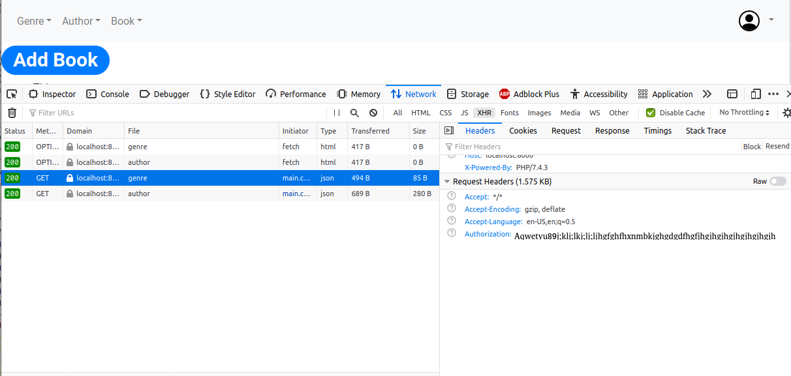

# Introduction
In this post, we are going to talk about how we can generate a class dynamically. Welcome to the brave new world of powerful possibilities. Generating classes dynamically as a concept, is as old as the Java language itself. RMI, J2EE, etc. used this powerful concept to a large extent. With the advent of Annotations in JDK 1.5, this became very popular. You had libraries pre-processing annotations and generating proxies to do away with lot of boiler-plate code. Especially worth mentioning are the Aspect Oriented Programming concepts (or AOP) around Transaction management. Suffice it to say that Spring and lot of other popular libraries like Hibernate, would not be able to function as they do, without this.

There are a number of very powerful libraries that allow you to generate classes dynamically. I had used [Apache BCEL](https://commons.apache.org/proper/commons-bcel/) a [bit longish back](https://palashray.com/your-cup-of-byte-code-re-engineering-bcel-style/). However, today, we will explore a simple, yet powerful library called [ByteBuddy](https://bytebuddy.net/#/).

# Let's build...
I am building a trivial Web Application with Spring Boot. It uses versioned REST APIs. Nothing fancy, just that each of the end points starts with its version. For example, the V1 of my API would be <http://localhost:8080/v1/bank-item/>. Similarly, no prizes for guessing, that the V2 of my API would be <http://localhost:8080/v2/bank-item/>.

# The Challenge
I have already built the V1 of my REST end point. And ofcourse, I have a RestController for that. Now, I am feeling too lazy to build the V2 of the same end point, as I know that would mean I have to write a DAO, a Service, the Model, the entire stack, before I even get to my RestController. And I love taking short cuts. So, can I extend my existing RestController for V1, and create another RestController such that it starts responding to my V2 requests? And can I do this dynamically too?

Let's see: well, there are many ways we could achieve this, but for the sake of brevity, we will stick to just 2 approaches.

# Solution 1: 
As described in my previous post, [Google Authentication with ReactJS and Typescript](http://palashray.com/google-authentication-with-reactjs-and-typescript/), this is how we obtain the *Google Token ID* in our *App.tsx*:

```reactjs
<GoogleSignInComponent loginSuccess={(response: GoogleLoginResponse | GoogleLoginResponseOffline) => {
      if ('tokenId' in response) {
        setGoogleAccessToken(response.tokenId);
      }
    }} />
```

Whenever we make any REST calls, we would use this *googleAccessToken*. For example, the below code fetches the list of *Genres*. Note how we pass the *googleAccessToken* as the *Authorization Header*

```reactjs
fetch(`${process.env.REACT_APP_REST_API_BASE_NAME}/genre`, {
    headers: {
        'Authorization': this.props.googleAccessToken
    }
}).then(response => response.json())
    .then(rawGenres => {
        const genres: ComboBoxItemValue[] = rawGenres.map((rawGenre: any) => {
            return {
                itemId: rawGenre.id,
                displayText: rawGenre.name
            } as ComboBoxItemValue;
        });

        this.setState({
            genres: genres,
            noGenresFound: genres.length === 0
        });
    });
```

# Testing with CURL
Boot up the [ReactJS Client](https://github.com/paawak/blog/tree/master/code/reactjs/library-ui-secured-with-google) and browse to <http://localhost:3000/>. You would see the login screen. Proceed to login with Google. Now hit *F12* to open the *Developer Console*. From the Menu, select Book -> Add New.



As shown above, you would be able to see the *Authorization Header* copy that. The curl command would be:

    curl -v -H "Authorization: MySecretToken" "http://localhost:8000/genre"

# Deploying on Apache

When deployed on Apache Server, the Authorization Headers cannot be read, happened with me. The solution is, in the .htaccess file, put the below lines:

    SetEnvIf Authorization "(.*)" HTTP_AUTHORIZATION=$1

# Sources
The Frontend code can be found here: <https://github.com/paawak/blog/tree/master/code/reactjs/library-ui-secured-with-google>.

The PHP Backend code can be found here: <https://github.com/paawak/blog/tree/master/code/php/php-rest-service-google-oauth2>.
