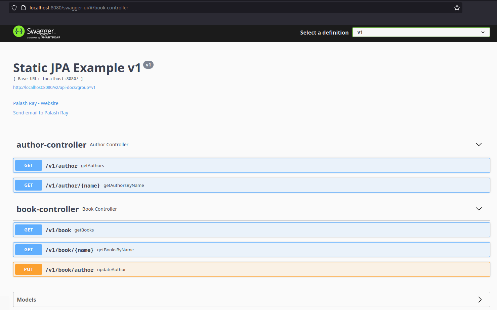
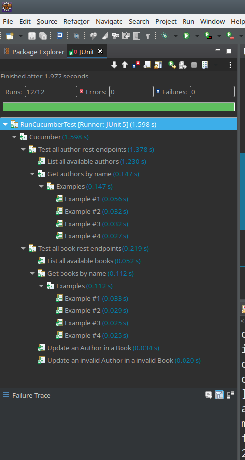

# Introduction
At the outset, be warned that this is not for the fainthearted. Be prepared for a long and arduous read. Having said that, lets begin.

Many a times, I have wondered, if I can ever create a JPA Entity and a JPA Repository class dynamically, on the fly? Well, its certainly possible, though a bit complicated.

# Library REST Service
We will be building a mock library service with Spring Boot and a in-memory H2 Database. There are broadly 2 REST endpoints:
1.  Author
1.  Book

Both of these allow us to fetch all items, and also search by partial name. These are GET calls.

On the Book, we have an additional PUT call that allows us the change the Author of a Book.

# Start Simple
We will build a very normal JPA based Spring Boot Application. We have called this the *static-jpa-repo-simple*. It consists of 2 Entities and JPA Repos for Book and Author respectively.

This is the Book entity:

```java
@Entity
@Table(name = "book")
@Data
public class Book {

    @Id
    @GeneratedValue(strategy = GenerationType.IDENTITY)
    private int id;

    @Column
    private String name;

    @OneToOne(fetch = FetchType.EAGER)
    @JoinColumn(name = "author_id")
    private Author author;

}
```

And this is the corresponding JPA Repository:

```java
public interface BookDao extends CrudRepository<Book, Integer> {

    List<Book> findByNameContainingIgnoreCase(String name);

    @Transactional
    @Modifying
    @Query("update Book set author.id = :authorId where id = :bookId")
    int updateAuthor(int bookId, int authorId);

}
```

The first method *findByNameContainingIgnoreCase()*, as the name indicates, would do a case-insensitive search on the *name* of a *Book*.

The second method *updateAuthor()* would update an *Author* in a given *Book*.

Pretty mundane, I would say. If you browse to the Swagger Page: <http://localhost:8080/swagger-ui/>, this is how it looks like:



## Sources
These sources can be found here: <https://github.com/paawak/spring-boot-demo/tree/master/dynamic-jpa/static-jpa-repo-simple>

# Test Harness
At this point, before we delve any further, we will write a BDD/Cucumber based test harness to test all our REST endpoints. Run the main class such that the Application starts at *http://localhost:8080*. Then, run the *RunCucumberTest*. This is very similar to our previous entry: <https://palashray.com/example-of-creating-cucumber-based-bdd-tests-using-junit5-and-spring-dependency-injection/>. As shown below, ensure all the tests are green.



# Making JPA Dynamic
## First Step: Abstraction


## Sources
The sources for the *static-jpa-repo-abstraction* can be found here: <https://github.com/paawak/spring-boot-demo/tree/master/dynamic-jpa/static-jpa-repo-abstraction>.
