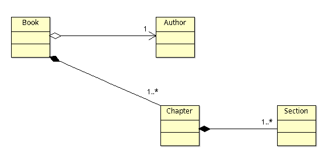

# Background
We have been using Spring JPA quite extensively in our project. We had a dashboard that was displaying around 100-odd JPA Entities, through a REST API. The object graph had, at max, 2 levels of hierarchy. When we ran a performance test we observed that the dashboard API call takes around 8 seconds to return. We started investigating. What we essentially uncovered was the __N+1 problem in Hibernate__. 

What that essentially means is this: suppose the root Entity has a list of __N Child Entities__. When you fetch the root Entity, after the first query is fired, lets say __Query 1__, then Hibernate fires the next __N Queries__ to fetch the children.

 This can lead to performance problems. I have heard many technologies shun JPA/Hibernate due to the framework's perceived slowness. Though not entirely unfounded, what they do not know is how to improve the performance by using JPA's Projections.

# The problem at hand
Let's talk about the problem first. We will take an example of a hierarchy of Entities as shown below:



## Trivial implementation

We will take a simple Spring Boot project. Add the below dependencies in the __pom.xml__:

```xml
		<dependency>
			<groupId>org.springframework.boot</groupId>
			<artifactId>spring-boot-starter-data-jpa</artifactId>
		</dependency>
		<dependency>
			<groupId>org.springframework.boot</groupId>
			<artifactId>spring-boot-starter-web</artifactId>
		</dependency>
		<dependency>
			<groupId>org.projectlombok</groupId>
			<artifactId>lombok</artifactId>
		</dependency>
```

The root Entity is the __Book__.

```java
@Data
@Entity
@Table(name = "BOOK")
public class Book implements Serializable {

    private static final long serialVersionUID = 1L;

    @Id
    @GeneratedValue(strategy = GenerationType.IDENTITY)
    private Long id;

    @Column(name = "title")
    private String title;

    @OneToOne(fetch = FetchType.EAGER, cascade = CascadeType.ALL, orphanRemoval = true)
    @JoinColumn(name = "author_id")
    private Author author;

    @JsonManagedReference
    @OneToMany(mappedBy = "book", fetch = FetchType.EAGER, cascade = CascadeType.ALL, orphanRemoval = true)
    private Set<Chapter> chapters;

}
```

The __Repository__ class is very simple as well:

```java
@Repository
public interface BookDao extends JpaRepository<Book, Long> {

}
```

We have a __Rest Controller__ that exposes the REST endpoints. It directly calls the __Repository__.

```java

@RestController
@RequestMapping("/books")
public class BookController {

	private final BookDao bookDao;

	public BookController(BookDao bookDao) {
		this.bookDao = bookDao;
	}

	@GetMapping
	public List<Book> getBooks() {
		return bookDao.findAll();
	}

  ...

```

## Print the Queries generated by JPA
In order to print the queries generated by JPA/Hibernate, you need to enable Debugs for as shown below in our __application.yml__:

```yaml
logging:
  level:
    root: INFO
    org.hibernate.SQL: DEBUG
```    

## Getting All Books

When we invoke the */books* end-point to fetch all books, we can see many queries getting fired. I am pasting some typical queries that can be seen.

```sql

-- the first query gets the root entity Book
select b1_0.id,b1_0.author_id,b1_0.title from book b1_0

-- subsequent queries get the children, in this case the author
-- there will be multiple of these
-- I am pasting just 2
select a1_0.id,a1_0.first_name,a1_0.last_name from author a1_0 where a1_0.id=?

select a1_0.id,a1_0.first_name,a1_0.last_name from author a1_0 where a1_0.id=?

-- next comes the queries to fetch the Chapters

select c1_0.book_id,c1_0.id,c1_0.plot_summary,s1_0.chapter_id,s1_0.id,s1_0.section_length,s1_0.section_text,s1_0.style,c1_0.title from chapter c1_0 left join section s1_0 on c1_0.id=s1_0.chapter_id where c1_0.book_id=?

select c1_0.book_id,c1_0.id,c1_0.plot_summary,s1_0.chapter_id,s1_0.id,s1_0.section_length,s1_0.section_text,s1_0.style,c1_0.title from chapter c1_0 left join section s1_0 on c1_0.id=s1_0.chapter_id where c1_0.book_id=?

-- finally comes the queries to fetch Sections
select s1_0.chapter_id,s1_0.id,s1_0.section_length,s1_0.section_text,s1_0.style from section s1_0 where s1_0.chapter_id=?

select s1_0.chapter_id,s1_0.id,s1_0.section_length,s1_0.section_text,s1_0.style from section s1_0 where s1_0.chapter_id=?

```

Note that the number of queries fired depend on the number of children associated with the parent entities. And this is the performance issue that we are talking about, popularly known as the __N+1 problem in Hibernate__.

# Solution: by the power of Projections
We use Projections to fetch only a subset of the entire object graph. If done well, we can have just a single query fetch the data we need. While there are many ways to do a Projection, like Class based and Interface based, today, we will see how to use Records to do Projections. Projections, like Spring JPA Query name, works on Bean naming convention.

Let us take a quick example: I have decided to fetch only the below 4 attributes from the entire object graph:
1. Book ID
1. Book Title
1. Author ID
1. Author First Name

Starting from the root Entity, which in this case is Book, I can intuitively define the below record which would fetch the properties using the Bean naming conventions:

```java
public record BookView(Long id, String title, Long authorId, String authorFirstName) {

}
```

Let us now modify our Repository class to take advantage of Projection the just defined.

```java
@Repository
public interface BookDao extends JpaRepository<Book, Long> {

	List<BookView> findAllByIdNotNull();

}
```

In the method __findAllByIdNotNull()__ that I have defined, I am saying that fetch all Books that have non-null IDs. Essentially this means all records as ID is my Primary Key.

Now let us expose this through our Controller:

```java
	@GetMapping("/view")
	public List<BookView> getBooksForView() {
		return bookDao.findAllByIdNotNull();
	}
```

Lets invoke the */books/view* endpoint, and observe the no. of queries printed on the console: its just this one.

```sql
select b1_0.id,b1_0.title,a1_0.id,a1_0.first_name from book b1_0 left join author a1_0 on a1_0.id=b1_0.author_id where b1_0.id is not null
```

If you see, Spring JPA knows exactly the attributes it needs to fetch from the entire object graph, so it has come up with a single *LEFT OUTER JOIN*. 

That is the power of the Projections!

# Sources
The sources for this example can be found here: <https://github.com/paawak/spring-boot-demo/tree/master/jpa-projection-demo>
